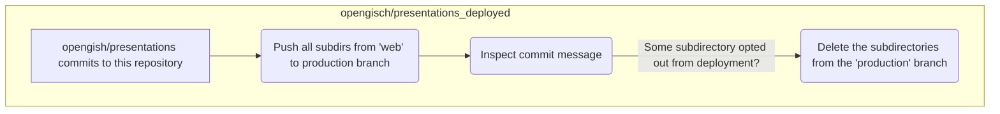

# staging

```mermaid
graph TD
    subgraph Alpha[opengisch/presentations_deployed]
        A[opengish/presentations commits to this repository] --> B(Push all subdirs from 'web' to production branch)
        B --> C(Inspect commit message) --> |Some subdirectory opted out from deployment?| D(Delete the subdirectories from the 'production' branch)
    end
    classDef r margin-right: 450px
    class Alpha r
```