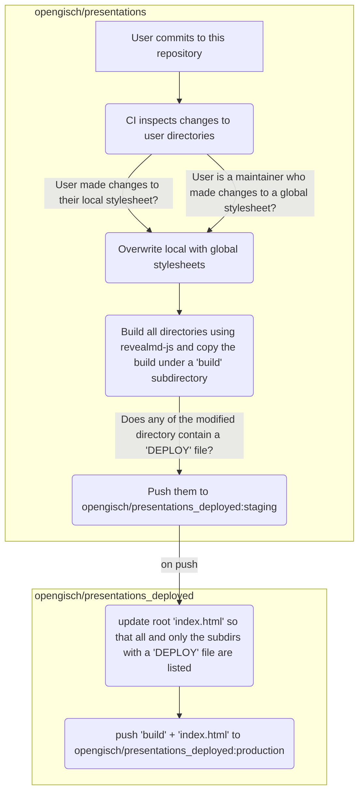

# staging

```mermaid
graph TD
    subgraph Alpha[opengisch/presentations]
        A[User commits to this repository] --> B(CI inspects changes to user directories)
        B --> |User made changes to their local stylesheet?| C(Overwrite local with global stylesheets)
        B --> |User is a maintainer who made changes to a global stylesheet?| C
        C --> D(Build all directories using revealmd-js and copy the build under a 'build' subdirectory)
        D --> |Does any of the modified directory contain a 'DEPLOY' file?| E(Push them to opengisch/presentations_deployed:staging)
    end
    subgraph Beta [opengisch/presentations_deployed]
        E --> |on push| F(update root 'index.html' so that all and only the subdirs with a 'DEPLOY' file are listed)
        F --> G(push 'build' + 'index.html' to opengisch/presentations_deployed:production)
    end
    classDef r margin-right: 450px
    class Alpha r
    class Beta r
```
